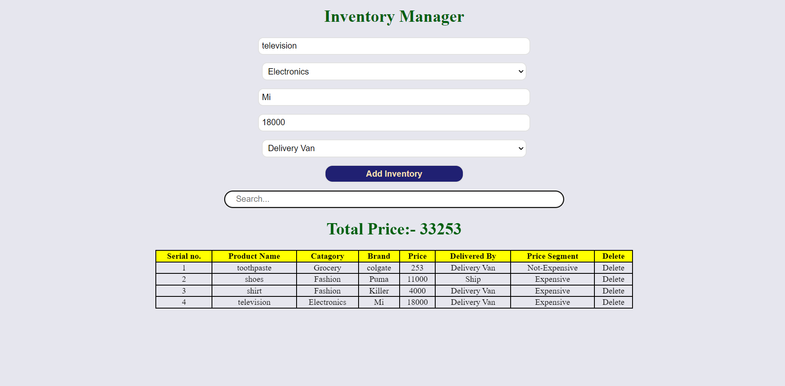
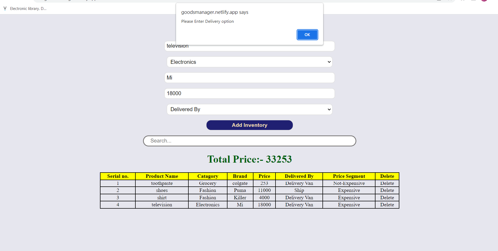

Link to inventory manager app = https://goodsmanager.netlify.app/

1. Adding product => In this inventory manager you can enter the products which you have bought and you can fill all the input box, which holds the details about the product.
2. Alert for vacant box => If any box is left vacant by mistake then you get the alert to fill it.
3. Delete product => If you want to delete and remove any of the product from the list then the last column provides you the facility to do so. 
4. Search items => If you have added lots of item and want to search for any particular item then the search box helps you to do so, by simply entering the keys related to the product

